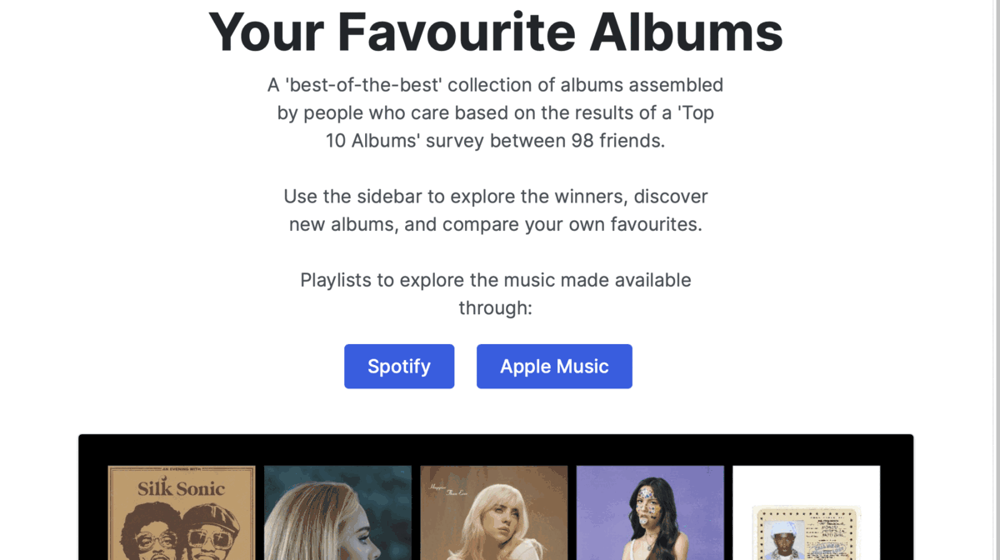

# [Your Favourite Albums (2021)](http://www.yourfavouritealbums2021.ca/)
After Will Friesen made his annual survey of friends for their top 10 albums of the year, he published the results in a spreadsheet. To help better investigate the their favourite albums (instead of the just the top results), this dashboard helps viewers visually and interactively compare rankings for the albums in the survey. Users can find more meaning the album ranks, discover new albums themselves, and enjoy the relevent playlists Friesen has put together.

Application built with Plotly Dash and deployed through Heroku at http://www.yourfavouritealbums2021.ca/ 

## The Data

A casual survey in December 2021 between Facebook friends let each participant name and rank their top 10 music albums that were released in 2021. This information was used to create a [master list](https://docs.google.com/spreadsheets/d/1E6YwZ5SdZPHBeOZQTKj22AWFnbCqjbhlv9Tplt73RQk/edit?fbclid=IwAR0lxp9NPKsdTe2mpNoLWL7eB7rmdtvafhdMIxx4He24wEobpU52PS_3kAM#gid=0) of "favourite albums" based on a combination of individual top-10 rankings, and total submission counts of each album. The survey was strictly opt-in, and participants names were recorded along with their choices.
## The Dashboard

The dashboard contains 3 different sub-pages for different perspectives on our data. 

The "Top 10" page lets users examine the highest-ranked albums based on album score (or simply total album submissions). Users can decide whether they want to include participants rankings in the survey for a weighted album score, or whether they want to judge based on each albums total number of votes.

The "Discover" page lets us view the entire dataset as a scatterplot of an albums popularity (total submissions) and it's quality (average ranking on each personal list). This lets us create different categories of albums that a user can search through interactively, and find new albums on a table below the scatterplot.

The "Compare" page lets viewers enter their own favourite album (or album they've found in the "Discover" page) to see how it compares to the highest ranked album and dataset at large. This choice of album persists through the other pages as well, so viewers can keep track of a specific album within the dataset they've selected.

# Contributors

* **Gavin Grochowski:** Created the dashboard.
* **Eric Warsaba:** Wrangled the raw data into a functional Google Sheets spreadsheet.
* **Will Friesen:** Carried out the survey to create the data.
# App Architecture

* index.py
    * *(Dash App to run server from and assemble layout from.)*
* app.py
    * *(Plotly Dash app objects to be imported around in components and callbacks and index.py)*
* Procfile
    * *(Necessary for gunuicorn Heroku Deployment)*
* runtime.txt
    * *(Necessary for gunuicorn Heroku Deployment)*
* layout/
    * callbacks.py
    * layout.py
    * components/
        * *(layout components)*.
        * viz/
            * *(visualization components).*
* assets/
    * *(our css and media files).*
* data/
    * datafunc.py
        * *(Functions for working with album data).
    * data.py
        * *(data objects from reading in data and pipeline.)
    * AOTY-2021.lists.csv
        * *our 2021 data*.
* tests/
    * *(unittesting files)*.
